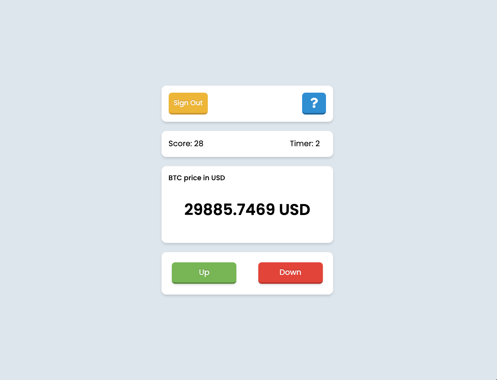

## BTC/USD Price Prediction Game

### 💡 About

A game where you can guess if the price of Bitcoin (BTC/USD) will be higher or lower after one minute. It uses real Bitcoin prices from trusted online sources, and updates in real time.

## 🎲 How to play it

- You'll guess whether the price of Bitcoin will be higher or lower after one minute by clicking the buttons:

  - "Up" button for price going up.
  - "Down" button for price going down.

- You can always see your score and the latest Bitcoin price.

- Once you make a guess, you must wait until the guess is resolved before you can guess again.

- The guess is checked after one minute, and you can only make one guess at a time.

- If you're right:

  - You said "up" and the price went up, or
  - You said "down" and the price went down.
  - You earn 1 point, and you'll get a toast message about it.

- If you're wrong:

  - You lose 1 point, and you'll get a toast message about it.
  - Your score will never go below 0.

- Your score is saved, so you can come back anytime to see your score and continue guessing.

## ⚡ Technologies

- `Vite`
- `React.js`
- `Firebase`
- `Zustand`
- `Tailwind CSS`
- `Playwright`

## 🚀 API

I got the real-time Bitcoin prices from a service called [Coinbase cloud](<(https://docs.cloud.coinbase.com/exchange/docs/websocket-overview)>).

To get the current Bitcoin price, I used the fetch method from a URL: "https://api.coindesk.com/v1/bpi/currentprice/BTC.json." Then, I used async/await to wait for the response and find the actual Bitcoin price from the JSON data.

I used WebSockets and a library called [ReconnectingWebSocket](https://github.com/joewalnes/reconnecting-websocket) to get real-time Bitcoin price updates. It connected to 'wss://ws-feed.pro.coinbase.com' and received live updates from Coinbase cloud whenever the Bitcoin price changed.

## 💭 Process:

I started by focusing on the game's features and testing. I didn't focus too much about how it looked in the beginning.

I first created the game screen with:

- A countdown timer
- Two buttons for the guesses (up & down)
- Display for players score
- The Bitcoin price

I started by creating the sign-up and sign-in components, including their functionalities, so I could save each user and their initial score, which is 0, in the backend.

After that, I worked on the game part. At first, I used random numbers for the price (`Math.random()`). Then, I set up the countdown timer. When the timer ends, a new price shows, and you can make your guess. At firsts, the `console.log` was the only place to see if your guess was right or wrong. Later, I added notifications on the screen to tell you whether your guess was correct.

One tricky part was finding a 3rd-party library to provide real Bitcoin prices because many of them charge money, but I finally found one that worked well and was for free. After setting up real-time Bitcoin prices, I moved to the backend to save the scores. Lastly, I added the sign-in/sign-up and home pages and styled the whole app.

## 🌪️ Challenges

Combining all the parts of the game to work together was a bit tricky. I had to learn about Websockets, which I hadn't used before, and how to fetch real-time Bitcoin prices using the library [ReconnectingWebSocket](https://github.com/joewalnes/reconnecting-websocket).

## 🤔 How can it be improved?

I could make the game more fun by adding sound effects for when you get points or lose them, or when you click on the buttons. Adding animations would make the game feel more lively too. Also, I might let you guess prices for other digital money like Ethereum, not just Bitcoin, so the players have more fun options to choose from when playing.

## 🎥 Demo/Preview

<video src="./public/video.mp4" controls="controls" width='100%'>
</video>

## 🚦 Running the Project

To run the project in your local environment, follow these steps:

1. Clone the repository to your local machine
2. Run `npm install` or `yarn` in the project directory to install the required dependencies
3. Setup your Firebase account and replace the Firebase config values in the `.env` file with your own
4. Run `npm start dev` or `yarn start dev` to get the project started.
5. Open http://localhost:5173 (or the address shown in your console) in your web browser to see the app.
